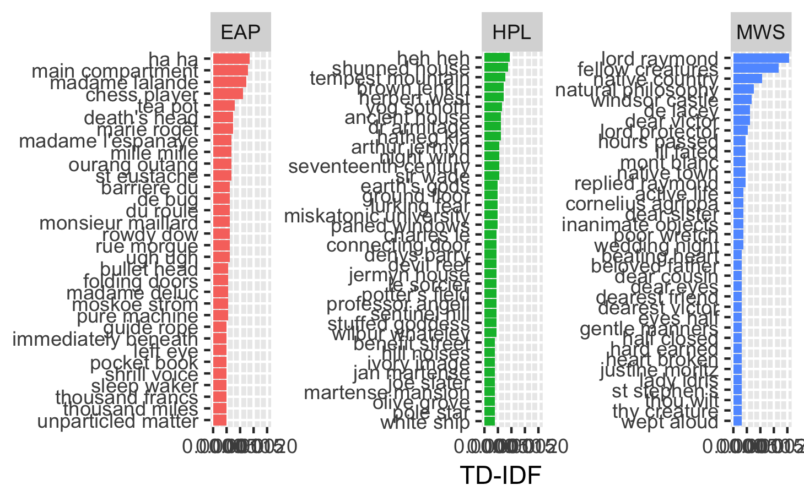
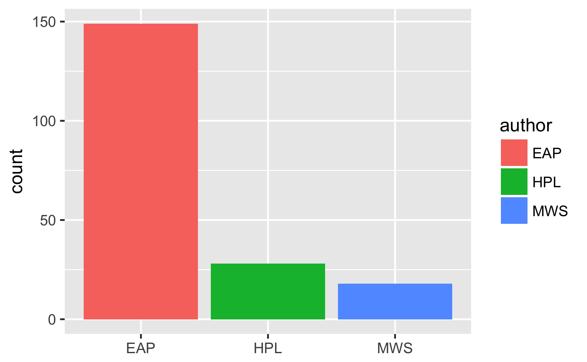
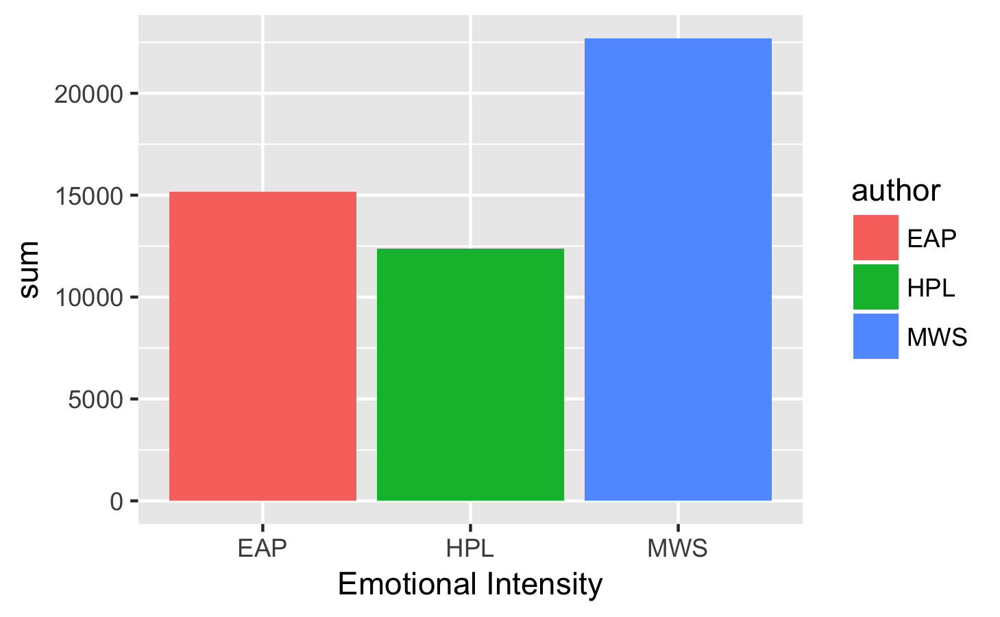
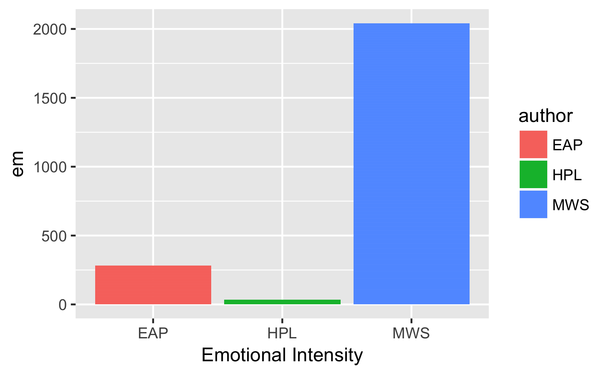

# Spring2018
# Project 1:

----


### [Project Description](doc/)


Term: Spring 2018

+ Project title: Project: Textual Analysis
+ This project is conducted by Noah Chasek-Macfoy
+ Project summary: 


I do 6 different kinds of analysis: Frequency, Tf_idf, Bigram, French language, Punctuation, and Emotional Intensity on sentences from Edgar Alan Poe (EAP), HP Lovecraft (HPL), and Mary Wollstonecraft Shelly (MWS) in order to find ways to distinguish between the author's prose. My primary results are that MWS uses far more emotionally intense language than the other two and that EAP uses far more french words than the other two. Below you will find two plots which highlight these two primary findings. 

I initially did unigram and bigram Tf_idf analysis to identify characteristic patterns in the author's texts. 

This plot is the top 3 highest tf_idf scoring bigrams for each author:


The above analysis gave me the suspicion that EAP might have a greater number of french words in his texts.

This plot shows how that suspicion proved accurate; EAP does use many more French words:


I went on to look at emotional intensity. This plot shows that MWS indeed does have more emotional intensity than other authors on average:


I also analyze emotional intensity in each sentence to see the source of MWS emotional intensity. It turns out that in addition to greater average emotional intensity scores she also has a number of extreme emotional intensity outlying sentences as indicated by this plot:


```
proj/
├── lib/
├── data/
├── doc/
├── figs/
└── output/
```

Please see each subfolder for a README file.
